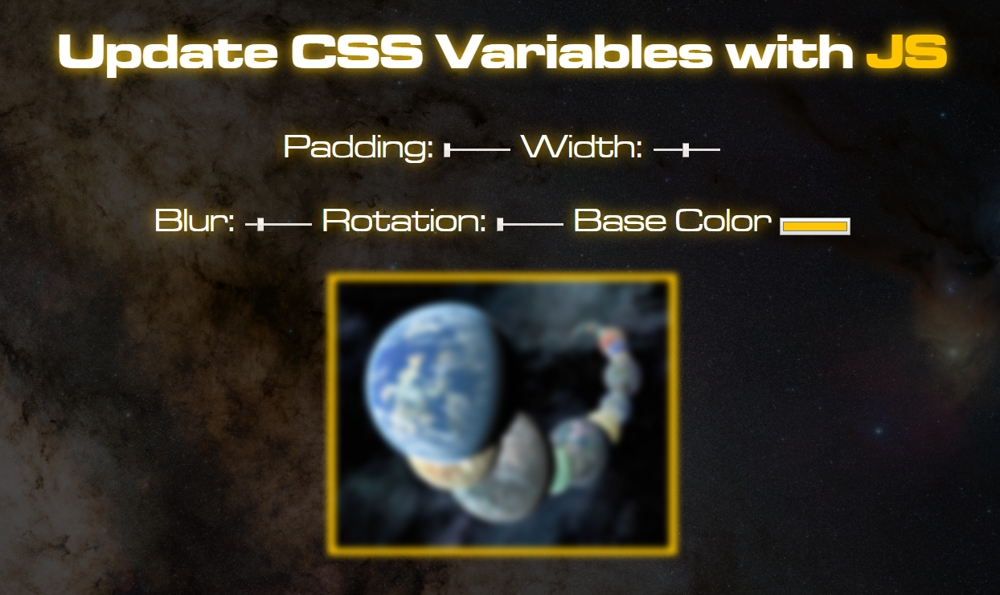

# [JavaScript30](https://javascript30.com/)

## **Day 03** - *Playing with CSS Variables and JS*

[All Projects](https://github.com/10xOXR/JavaScript30/blob/master/README.md) | [<< Prev #02](https://github.com/10xOXR/JavaScript30/tree/master/day02) | [Next #04 >>](https://github.com/10xOXR/JavaScript30/tree/master/day04)

---

## Credits

### Media

- [NASA Exoplanets](https://exoplanets.nasa.gov/news/1581/discovery-alert-a-record-haul-planet-count-hits-4000/) - Image

- [Wikipedia - Rho Ophiuchus](https://en.wikipedia.org/wiki/Ophiuchus#/media/File:Guisard_-_Milky_Way.jpg) - Wallpaper