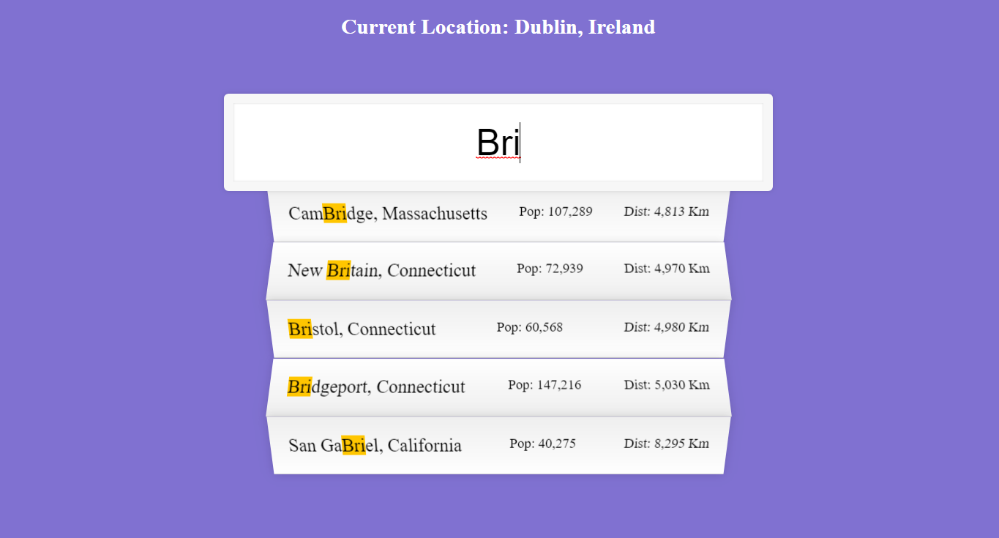

# [JavaScript30](https://javascript30.com/)

## **Day 06** - *Type Ahead*

[All Projects](https://github.com/10xOXR/JavaScript30/blob/master/README.md) | [<< Prev #05](https://github.com/10xOXR/JavaScript30/tree/master/day05) | [Next #07 >>](https://github.com/10xOXR/JavaScript30/tree/master/day07)

---

## Credits

### Additional Code

- [Stack Overflow](https://stackoverflow.com/questions/18883601/function-to-calculate-distance-between-two-coordinates) - Function to calculate distance between two coordinates